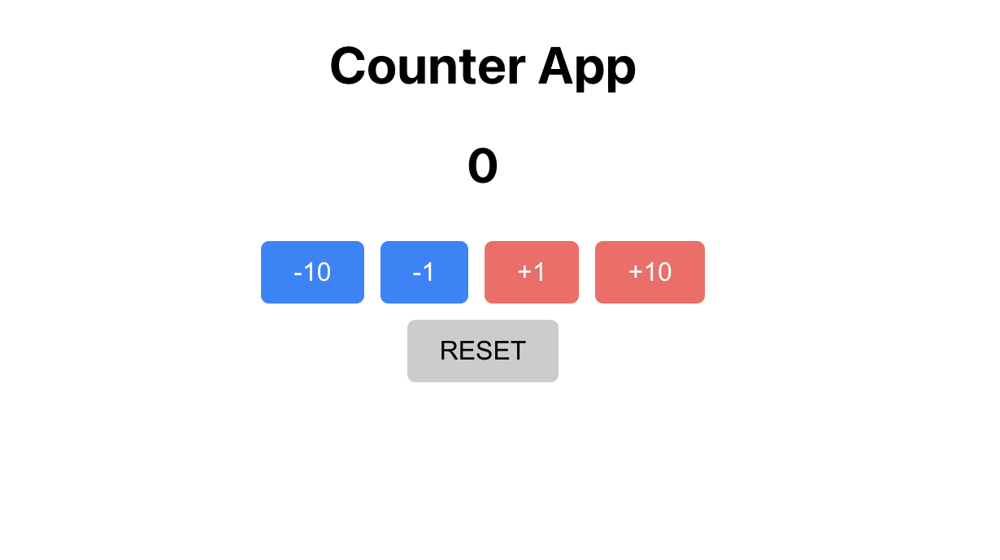

# Week 10 WIL

[과제 배포링크]()

카운터 앱에서 버튼을 컴포넌트화해서 사용하기 위해, Button.js를 추가하였다.

~~~
import React from 'react';
import './Button.css';

function Button({ onClick, action, className }) {
  return (<button onClick={onClick} 
    className={className}>
    {action}
  </button>);
}

export default Button;
~~~

처음에는 action을 받는 것까지만 해서 각 버튼을 실행했을 때 뜨는 글자를 결정해주는 것까지만 만들었는데, 만들고 보니까 +와 -를 구별하고 싶었다.
그래서 blueBtn과 redBtn, reset으로 구별하기 위해서 className도 함께 받아주는 것으로 수정했다.

~~~
  return (
    

      <CountNumber count={count} />
      

        

          <Button onClick={tendecrement} action="-10" className="blueBtn" />
          <Button onClick={decrement} action="-1" className="blueBtn" />
          <Button onClick={increment} action="+1" className="redBtn" />
          <Button onClick={tenincrement} action="+10" className="redBtn" />
        

        <Button onClick={reset} action="RESET" className="reset" />
      

    

  );
~~~
Counter.js의 return문이다. 
위쪽에는 각각 onClick 안에 들어갈 함수들이 정의되어 있다. action에 들어가는 저 글자들이 버튼 위에 쓰여지게 된다.

 

css도 꾸며보았다.
~~~
button {
    padding: 10px 20px;
    font-size: 16px;
    border: none;
    border-radius: 5px;
    margin: 5px;
  }
  
  .blueBtn {
    background-color: #1585fd;
    color: white;
  }
  
  .blueBtn:hover {
    background-color: #2186f1;
    outline-style: solid;
    outline-color: #0a54a4;
    outline-width: 3px;
    transform: scale(1.2);
  }
  
  .redBtn {
    background-color: #fc6464;
    color: white;
  }
  
  .redBtn:hover {
    background-color: #e13535;
    outline-style: solid;
    outline-color: darkred;
    outline-width: 3px;
    transform: scale(1.05);
  }
  
  .reset {
    background-color: #cccccc; 
    color: black;
  }
  
  .reset:hover {
    background-color: #999999;
    outline-style: solid;
    outline-color: gray;
    outline-width: 3px;
    transform: scale(1.05);
  }
~~~

이전에 했었던 프로젝트에서 이미지를 호버링하는 것을 했었는데, 좀 더 눈에 띄게 transform 스타일도 넣고, 과제 명세에 있었던 outline 키워드도 설정을 했다. 처음에 style을 빼고 color, width만 작성했더니 아예 적용되지 않았다. 찾아보니까 style은 꼭! 명시를 해줘야 한다고 한다.