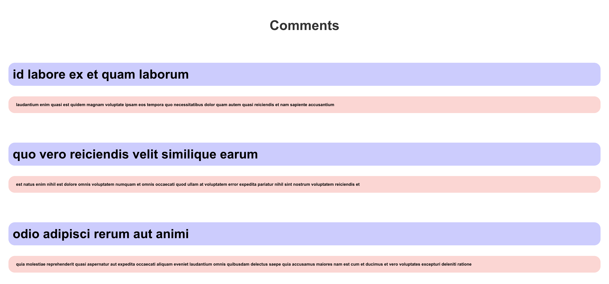

# Week 11 WIL

[과제 배포링크](https://week11-siamin20s-projects.vercel.app/)

4주차 스터디와 똑같이, Comments api를 사용하여 구현하였다.
components 폴더에 Comment.js, CommentList.js를 생성하였다.
내용을 다 가져오지 않고, 상위 10개만 출력하도록 변경했다.

~~~
import React from "react";

function Comment({ name, body }) {
  return (
    

      <h2>{name}</h2>
      <h3>{body}</h3>
    

  );
}

export default Comment;
~~~
comment는 불러올 때 name과 body에 각각 스타일을 적용하여 return한다.

~~~
import React, { useState, useEffect } from "react";
import Comment from "./Comment";

function CommentList() {
  const [comments, setComments] = useState([]);

  useEffect(() => {
    fetch("https://jsonplaceholder.typicode.com/comments")
      .then((response) => response.json())
      .then((data) => setComments(data.slice(0, 10))); // 상위 10개의 댓글만 표시
  }, []);

  return (
    

      {comments.map((comment) => (
        <Comment key={comment.id} name={comment.name} body={comment.body} />
      ))}
    

  );
}

export default CommentList;
~~~
CommentList는 api에서 fetch 받고, 이 중 10개 댓글만 띄운다.

