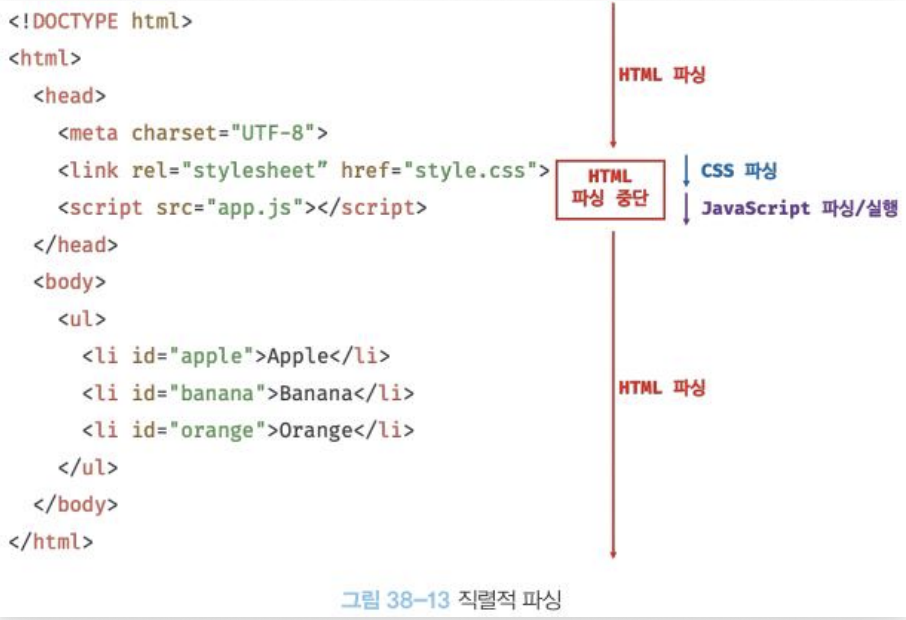

# Week 4 WIL

## class
내가 원하는 태그만 분류해서 스타일을 동시에 적용
### span이란?
    ex) 신짱구
    범위, 공간, 간격 등의 의미로 쓰이는 태그

### class 예시
    [style.css]
    .zzang {
        color: red;
        background-color: yellow;
    }

    [index.html]
    <body>
    <h1>신짱구</h1>
        
안녕하세요. 저는 떡잎마을에 사는 신짱구입니다. 5살이에요.

    <h2>가족 관계</h2>
        
엄마, <a href="./father.html">아빠</a>, 저, 동생. 그리고 흰둥이와 함께 살아요.

    여러 단어(신짱구, 저)를 하나의 class로 묶기 위해 span 사용

기존의 스타일 선언에서 선택자가 .인 스타일
선택자를 점(.)으로 시작하면 class

### class가 뭐지?
    분류를 하기 위한 집단

## CSS의 id
    counter.html의 id 속성
        
0

        <button id="increase">+1</button>
        <button id="reset">RESET</button>
        <button id="decrease">-1</button>
    
    하나의 id는 하나의 태그
    class와 다른 점?
        class : 분반
        id : 학번
    
    class는 .으로 시작한다면 id는 #으로 시작

 

## JavaScript
    - HTML, CSS만으로는 웹 문서에서 a 태그를 타고 다른 페이지로가는 기능만
    - 웹 문서가 일방적으로 정보를 주는 상태
    웹 문서를 동적으로 만들자, 내가 작성한 스크립트대로 웹문서를 조작하자.
    
    Q. 자바랑은 뭔 관곈가요?
    A. 인도에게 인도네시아 묻기 ㅋㅋ

### JS를 연결하는법
    counter.html - body 태그의 마지막 부분에 app.js 연결
        

        script 태그는 </body> 앞에 작성
        동작방식 때문에 이렇게 작성해야 함

    app.js 
        const number = document.getElementById("counting-num");
        number.textContent = 100;

        document는 script로 연결된 HTML 문서를 의미
        id가 counting-num인 변수를 number로 정의하겠다!

        !! DOM 트리를 조작하는 행위

## script 태그의 위치와 브라우저의 동작 방식

    브라우저가 하는 일
    1. HTML 파일 열기
    2. HTML문서를 한 줄 한 줄 순차적으로 읽기 (파싱)
    3. DOM 트리 만들기
    4. 화면에 표시하기

    HTML 파싱 중 script 발견하면
    1. 파싱 중단
    2. js 파일 다운로드
    3. js 파일 실행
    4. HTML 이어서 파싱

HTML 파싱 중에 script 발견하면 뭐가 문제죠?
    1. 화면이 늦게 뜬다. 렌더링을 마치고 JS를 해석해도 늦지 않다...
    2. 순서가 꼬인다. JS에서 수정한 id가 아직 HTML 상에 없으면..?
