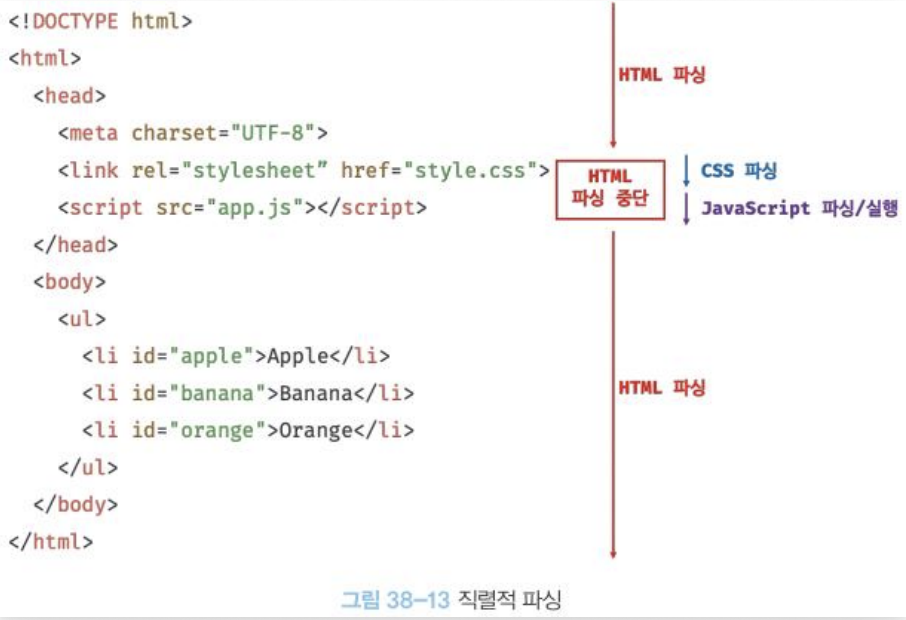

# Week 5 WIL

https://incandescent-twilight-7aa907.netlify.app

# 서버와 통신하기

JSON Placeholder
https://jsonplaceholder.typicode.com/   
API를 받아올 수 있는 사이트
## API가 뭔데?
    - 서버: 서버는 고객이 요청하면 뭔가를 서빙함
    - 클라이언트: 고객

**API (Application Programming Interface)**

    서로 다른 소프트웨어인 서버-클라이언트 간 상호작용을 돕는 인터페이스

### 프론트엔드? 백엔드?
    - 프론트엔드: 사용자가 직접 상호작용하는 웹 페이지의 화면을 다루는 개발 영역
    - 백엔드: 서버에서 동작하는 부분을 다루는 개발 영역 - 비즈니스 로직 처리, 인증, 보안 등

### fetch 함수
    네트워크 요청을 서버 데이터를 받아오는 표준 API 함수
    비동기로 데이터를 처리하므로, then 처리를 하게 됨

 

# 데이터를 화면에 뿌리기
    1. 새로운 태그를 만든다.
    2. 태그에 데이터를 넣는다.
    3. 새로운 태그를 root에 추가한다.

### forEach 함수
    순회조건을 만들지 않아도 사용할 수 있는 반복문

    function render(data) {
      data.forEach((item) => {
        const h2 = document.createElement("h2");
        h2.textContent = item.title;
        root.appendChild(h2); 
      });
    }

### DOM이 뭘까?

    브라우저가 하는 일

    1. HTML 파일 열기
    2. HTML문서를 한 줄 한 줄 순차적으로 읽기 (파싱)
    3. DOM 트리 만들기
    4. 화면에 표시하기

DOM? Document Object Model
HTML 태그 하나하나를 자바스크립트로 컨트롤할 수 있도록 만든 체계(계층적 구조, 트리 구조)